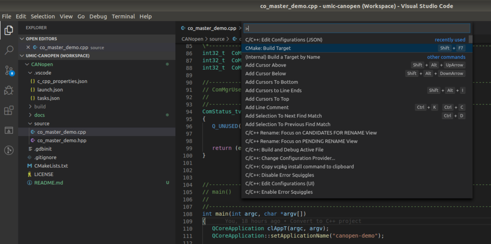
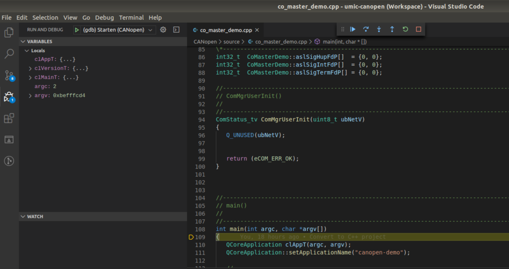

# **CANopen Master** Example

This code provides an example for the CANopen Master library. 
It scans the network for CANopen slave devices and prints details on the console. The program has
several options, the used CAN interface must be supplied to start the program.


```
./canopen-demo --help
Usage: ./canopen-demo [options] interface
CANopen Master demo

Options:
  -h, --help                Displays this help.
  --heartbeat-cycle <time>  Cycle time for heartbeat service in [ms]
  --sync-cycle <time>       Cycle time for SYNC service in [ms]
  -v, --version             Displays version information.

Arguments:
  interface                 CAN interface, e.g. can1
```


In order to start the demo on CAN1 with a heartbeat cycle time of 500 ms use the following
command:

```
./canopen-demo --heartbeat-cycle 500 can1
```


## How to build

Open the project inside Visual Studio Code and select `CMake: Build Target`
from the Command Palette (`STRG + Shift + P`). As alternative you can press
`Shift + F7`. 



## How to run

Copy the program to the µMIC.200 controller by selecting `Terminal -> Run Task...`
from the menu. Start the download by selecting `Copy program`. Open the terminal
view in Visual Studio Code (`CTRL + Shift + ´`) and connect to the µMIC.200
controller.

```
ssh umic@umic.200
./canopen-demo can1
```


## How to debug

Open the terminal view in Visual Studio Code (`CTRL + Shift + ´`) and connect to the µMIC.200
controller. Start the GDB server on the µMIC.200 controller.

```
ssh umic@umic.200
gdbserver :2345 ./canopen-demo can1
```


Select `Debug -> Start Debugging` from the menu or press `F5`. The debugger will start and
set a breakpoint at the first code line of the program.


